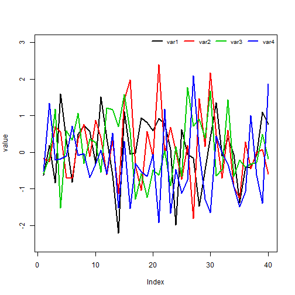
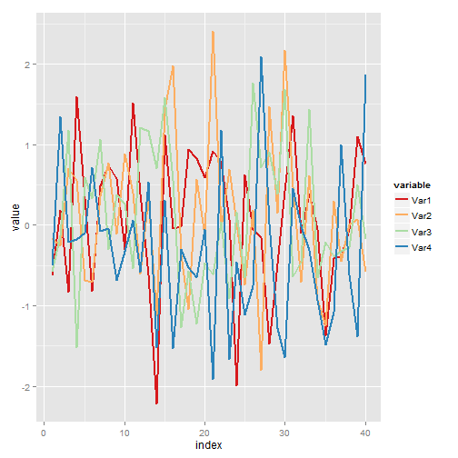
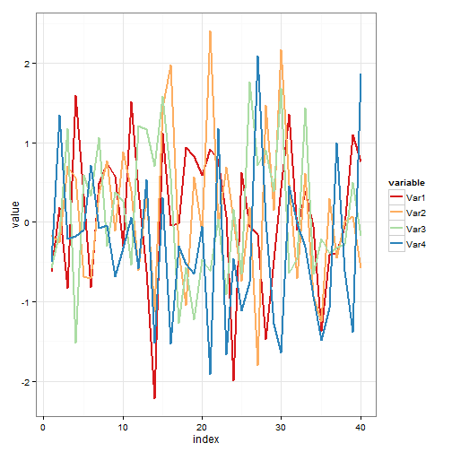
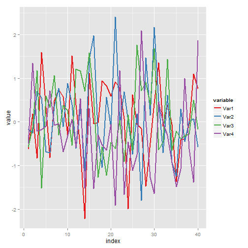
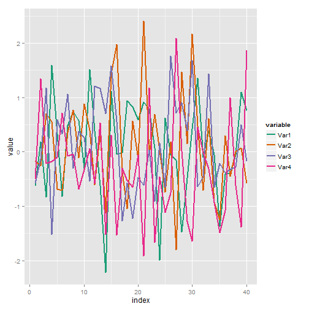
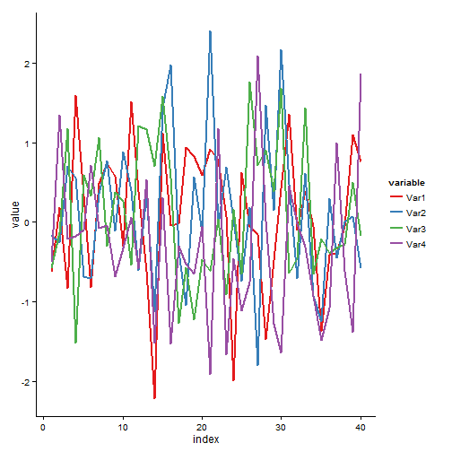

## Simulation des variables aléatoires

Commençons d'abords par la création de notre jeu de données.


```r
set.seed(1)
newdata <- data.frame(Var1= rnorm(40), Var2= rnorm(40), Var3= rnorm(40),
                      Var4= rnorm(40), index=1:40)
```

## Représentation avec plot R-base

La représentation graphique avec la fonction *plot* de R-base est comme suit:


```r
plot(newdata$Var1, col=1, ylim= c(-2.5, 3), ylab= "value", type="l", lwd=2)
lines(newdata$Var2, col=2, lwd=2)
lines(newdata$Var3, col=3, lwd=2)
lines(newdata$Var4, col=4, lwd=2)
legend("topright", legend = c("var1", "var2", "var3", "var4"),
       col= 1:4, lwd=2,ncol=4, cex=0.8, bty="n", bg="white")
```

 

## Transformation avec reshape2

Si on veut obtenir un graphe d'une qualité supérieure on peut utiliser le package *ggplot2*. Pour réaliser notre graphe avec ce package nous allons d'abords transformé notre jeu de données à l'aide du package *reshape2*.


```r
library(reshape2)
Mnewdata <- melt(newdata, id = "index")
```

## Représentations avec ggplot2

Enfin, ci- dessous quelques graphiques réalisés avec la fonction *ggplot*:


```r
library(ggplot2)
ggplot(Mnewdata, aes(index, value, colour=variable)) +
    geom_line(size=1) +
    scale_color_brewer(palette="Spectral")
```

 

## Représentations avec ggplot2 (2)


```r
ggplot(Mnewdata, aes(index, value, colour=variable)) +
    geom_line(size=1) +
    scale_color_brewer(palette="Spectral") + theme_bw()
```

 

## Représentations avec ggplot2 (3)


```r
ggplot(Mnewdata, aes(index, value, colour=variable)) +
    geom_line(size=1) +
    scale_color_brewer(palette="Set1")
```

 

## Représentations avec ggplot2 (4)


```r
ggplot(Mnewdata, aes(index, value, colour=variable)) +
    geom_line(size=1) +
    scale_color_brewer(palette="Dark2")
```

 

## Représentations avec ggplot2 (5)


```r
ggplot(Mnewdata, aes(index, value, colour=variable)) +
    geom_line(size=1) +
    scale_color_brewer(palette="Set1") +
    theme_classic()
```

 
